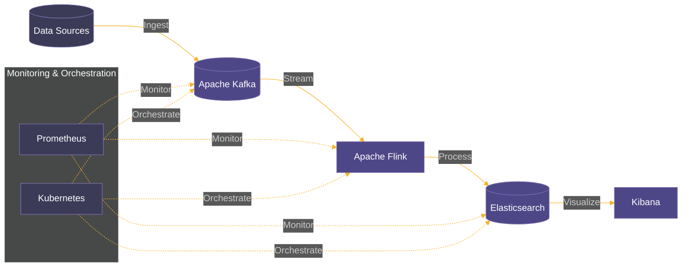

# Real-time Data Processing Pipeline

## Overview

This project implements a highly scalable, fault-tolerant real-time data processing pipeline using Apache Kafka for data ingestion, Apache Flink for stream processing, and Elasticsearch for data storage and retrieval. The system is designed to handle massive volumes of data and provide real-time analytics and visualizations, suitable for large-scale applications similar to those used by major tech companies.

## Architecture



## Key Components

### 1. Data Ingestion with Apache Kafka

- Acts as the central nervous system for data ingestion
- Provides high-throughput, fault-tolerant data streaming
- Designed to handle millions of events per second
- Ensures scalability for large-scale applications

### 2. Stream Processing with Apache Flink

- Employed for real-time stream processing
- Offers low-latency, high-throughput data processing
- Implements exactly-once processing semantics
- Supports complex event processing (CEP)
- Integrates machine learning models for real-time predictions and anomaly detection

### 3. Data Storage and Retrieval with Elasticsearch

- Stores and indexes processed data
- Enables fast and efficient data retrieval and analytics
- Implements index lifecycle management
- Uses custom analyzers and mappings to optimize search performance
- Distributed nature ensures high availability and fault tolerance

### 4. Visualization with Kibana

- Creates dynamic dashboards and visualizations
- Provides real-time insights into processed data
- Implements role-based access control
- Offers custom visualizations for different user groups and use cases

### 5. Monitoring and Orchestration

- **Prometheus**: Comprehensive system monitoring and alerting
- **Kubernetes**: Container orchestration for efficient resource management and scaling

## Technologies Used

- Apache Kafka
- Apache Flink
- Elasticsearch
- Kibana
- Java
- Python
- Docker
- Kubernetes
- Prometheus
- Grafana

## Features

- Scalable data ingestion capable of handling millions of events per second
- Real-time stream processing with complex event processing capabilities
- Machine learning integration for predictive analytics and anomaly detection
- Fast and efficient data storage and retrieval
- Dynamic data visualization and dashboarding
- Comprehensive monitoring and alerting system
- Containerized deployment for easy scaling and management
- Fault-tolerant design with high availability

## Demonstration: E-commerce User Behavior Tracking

This project includes a demonstration of real-time e-commerce user behavior tracking and analysis.

### Data Description

The system processes the following types of events:
- Page Views: {user_id, page_url, timestamp}
- Product Views: {user_id, product_id, timestamp}
- Add to Cart: {user_id, product_id, quantity, timestamp}
- Purchases: {user_id, product_id, quantity, price, timestamp}

### Running the Demonstration

1. Start the data generator:
   ```
   python scripts/ecommerce_data_generator.py
   ```
   This script simulates user activity on an e-commerce platform, generating events and sending them to Kafka.

2. Deploy the Flink job for processing e-commerce events:
   ```
   flink run -d jobs/ecommerce_analytics_job.jar
   ```
   This job reads events from Kafka, processes them in real-time, and writes results to Elasticsearch.

3. Access the Kibana dashboard:
   ```
   kubectl port-forward service/kibana 5601:5601
   ```
   Open `http://localhost:5601` in your browser and navigate to the "E-commerce Analytics" dashboard.

### What You'll See

The Kibana dashboard provides real-time insights including:
- User flow through the website (funnel visualization)
- Most viewed and purchased products
- Real-time conversion rates
- Average time to purchase
- Geographical distribution of users (if location data is included)

### Extending the Demonstration

You can extend this demonstration by:
- Adding more complex event processing logic in the Flink job
- Implementing real-time recommendations based on user behavior
- Integrating machine learning models for predicting user actions or product popularity

## Installation

1. Clone the repository:
   ```
   git clone https://github.com/yourusername/real-time-data-pipeline.git
   cd real-time-data-pipeline
   ```

2. Install dependencies:
   ```
   # Install Java dependencies
   mvn install

   # Install Python dependencies
   pip install -r requirements.txt
   ```

3. Set up Kubernetes cluster (if not already available)

4. Deploy components using Helm charts:
   ```
   helm install kafka kafka-chart/
   helm install flink flink-chart/
   helm install elasticsearch elasticsearch-chart/
   helm install kibana kibana-chart/
   helm install prometheus prometheus-chart/
   ```

## Usage

1. Configure data sources in the Kafka Connect config files

2. Deploy Flink jobs:
   ```
   flink run -d path/to/your/flink/job.jar
   ```

3. Access Kibana dashboard:
   ```
   kubectl port-forward service/kibana 5601:5601
   ```
   Then open `http://localhost:5601` in your browser

4. Monitor the system using Prometheus and Grafana:
   ```
   kubectl port-forward service/prometheus 9090:9090
   kubectl port-forward service/grafana 3000:3000
   ```

## Project Structure

```
real-time-data-pipeline/
├── src/
│   ├── main/
│   │   ├── java/  # Flink jobs and processing logic
│   │   └── python/  # Helper scripts and data generators
├── config/
│   ├── kafka/
│   ├── flink/
│   └── elasticsearch/
├── scripts/
│   └── ecommerce_data_generator.py
├── jobs/
│   └── ecommerce_analytics_job.jar
├── kubernetes/
│   ├── kafka.yaml
│   ├── flink.yaml
│   └── elasticsearch.yaml
├── dashboards/
│   └── ecommerce_analytics.json  # Kibana dashboard configuration
└── README.md
```

## Scalability and Performance

- Horizontal scaling of all components (Kafka brokers, Flink TaskManagers, Elasticsearch nodes)
- Use of partitioning in Kafka and sharding in Elasticsearch for data distribution
- Implement backpressure mechanisms to handle traffic spikes
- Multi-AZ and multi-region deployment for disaster recovery

## Security Considerations

- Encryption in transit using TLS
- Role-based access control (RBAC) across all components
- Kafka's SSL authentication and authorization
- Network segmentation and firewalls

## Future Enhancements

1. Implement real-time anomaly detection using Flink and machine learning
2. Explore using Apache Pulsar as an alternative to Kafka for unified stream-batch processing
3. Implement automated scaling based on workload using Kubernetes Horizontal Pod Autoscaler
4. Explore using GraphQL for more flexible data querying in the visualization layer

## Contributing

We welcome contributions to this project. Please feel free to submit issues and pull requests.

## License

This project is licensed under the MIT License - see the [LICENSE.md](LICENSE.md) file for details.

## Acknowledgments

- Apache Software Foundation for Kafka, Flink, and other open-source tools
- Elastic for Elasticsearch and Kibana
- The Kubernetes and Prometheus communities

For more detailed information, code samples, and deployment instructions, please refer to the documentation in the `docs/` directory.
